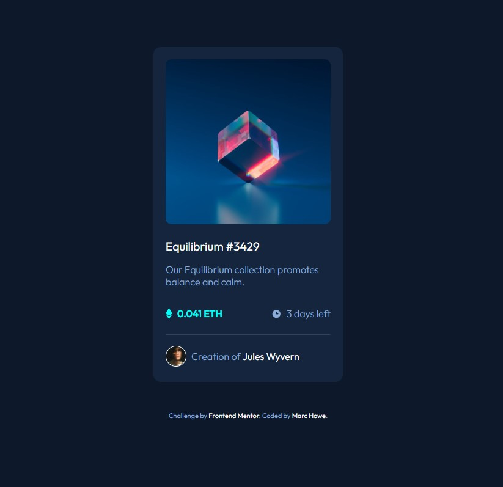

# Frontend Mentor - NFT preview card component solution

This is a solution to the [NFT preview card component challenge on Frontend Mentor](https://www.frontendmentor.io/challenges/nft-preview-card-component-SbdUL_w0U). Frontend Mentor challenges help you improve your coding skills by building realistic projects. 

## Table of contents

- [Overview](#overview)
  - [The challenge](#the-challenge)
  - [Screenshot](#screenshot)
  - [Links](#links)
- [My process](#my-process)
  - [Built with](#built-with)
  - [What I learned](#what-i-learned)
  - [Continued development](#continued-development)
  - [Useful resources](#useful-resources)
- [Author](#author)

## Overview

### The challenge

Users should be able to:

- View the optimal layout depending on their device's screen size
- See hover states for interactive elements

### Screenshot

### Links

- Solution URL:(https://www.frontendmentor.io/solutions/nft-preview-card-using-flex-and-interactive-hoveractive-conditions-qJaWhRmzmO)
- Live Site URL:(https://nft-preview-card-eq3.pages.dev/)

## My process

I began with a mobile-first approach and added the html required to define the card, card details and images. Next I worked on styling the image, card, fonts and colors to get it relatively close to the design. The most complicated areas at this stage were aligning the Ethereum icon, value, clock image and text '3 days left' onto one line, and adding the active state for the image with a second 'eye' image and add the primary cyan color as a background on click. I decided upon a 0.5s transition on the image as that looked good and setting a hover state color to the primary blue color, so there was some indication of "links" existing. 

### Built with

- Semantic HTML5 markup
- CSS custom properties
- Flexbox
- Mobile-first workflow

### What I learned

I learned about using the float:left/right and clear:both; commands to have elements exist on one line, and the css flex works well to vertically align images to text in this way. I discovered how to change the pointer to a link-style pointing hand with cursor:pointer for link states, such as :hover, and that you can apply the :link, :visited, :hover and :active psuedo commands to a div, as well as use two images with a fade in and out for either to create a nice effect! 

### Continued development

Continuing this journey through FrontEnd Mentor, I'll start the next project!

### Useful resources

- [Left Align and Right Align Text on the Same Line](https://css-tricks.com/left-align-and-right-align-text-on-the-same-line/) - CSS Tricks post that helped me with the 'all on the same line' challenge. 
- [Vertically align text next to an image](https://stackoverflow.com/questions/489340/vertically-align-text-next-to-an-image) - This was a StackOverflow question and answer that helped with the above same issue. 
- [How to apply CSS image affects](https://www.w3schools.com/howto/howto_css_image_effects.asp) - I didn't use this but came across it, could be useful in the future! 
- [Image overlay with opacity](https://www.w3schools.com/howto/tryit.asp?filename=tryhow_css_image_overlay_opacity) - This was the information that helped me with overlaying the main image with another and setting the opacity and transition effects. 

## Author

- Website - [Marc Howe](https://mjhcloud.com)
- Frontend Mentor - [@MarcHowe](https://www.frontendmentor.io/profile/MarcHowe)
- Twitter - [@marchowe83](https://www.twitter.com/marchowe83)

